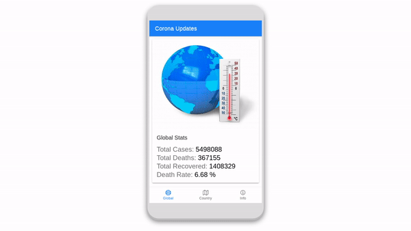

> ☢️ Corona Global & Country Updates!

  

  
   

    

This is a beauiful and light weight app to give the user global stats and stats per country while obtaining a minimal and sleek design. 
 
You can view the app online over
<a href="https://covidapp.micaelil.com/">
 here
</a>
.
     
 You can download the APK over 
<a href="https://covidapp.micaelil.com/cvoidapp.apk" download="cvoidapp">
 here
</a>
.
 
## Getting Started
### Prerequisites
To get started on developing locally make sure to have Cordova and Android-sdk tools installed on your local machine.
### Developing locally
Clone Project
 
`git clone https://github.com/micaelillos/CoronaUpdatesApp.git`
 
`cd CoronaUpdatesApp`
 
 
Run project
 
`cordova run android` or `cordova run ios`
## Deployment
Deploy
 
`cordova build android` or `cordova build ios`
 
 
Make signed apk or ipa file and deploy to play store  or app store

## Built With
* [Cordova](https://cordova.apache.org/) - The cross platform framework used
* [Ionic](https://ionicframework.com/docs/) - CSS framework

## Author
* **Micael Illos** - *Get in touch* - <a href="https://micaelil.com"> Website </a>
